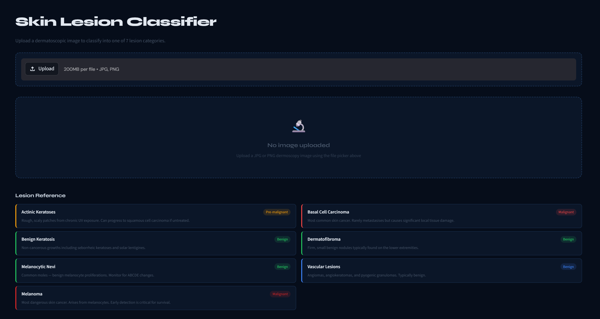
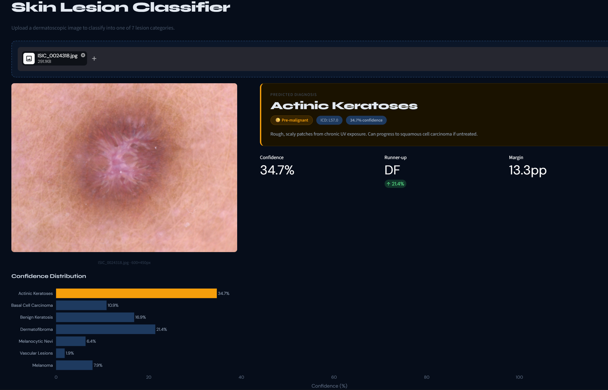
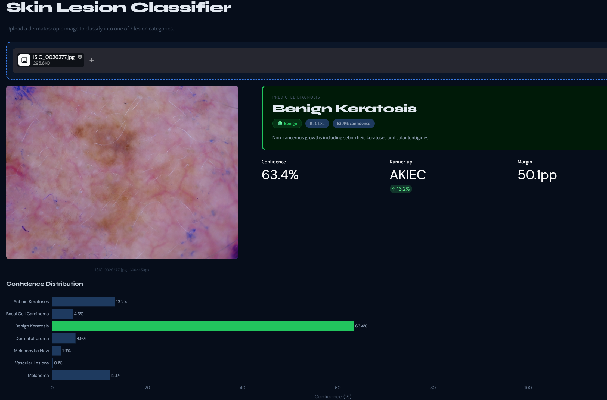

# Skin Cancer Classification system

A deep learning project that classifies dermatoscopic skin lesion images into **7 diagnostic categories** using the **HAM10000 dataset**, with an interactive **Streamlit web application** for inference and prediction visualization.

🚀 **Live Demo: [skin-cancer-ham10000.streamlit.app](https://skin-cancer-ham10000.streamlit.app)**

---

## Screenshots

### Empty State — Lesion Reference


### Prediction — Actinic Keratoses


### Prediction — Benign Keratosis


---

## Overview

This project implements a complete deep learning pipeline for **skin lesion classification** using a custom **Convolutional Neural Network (CNN)**. The system assists in identifying potentially malignant skin lesions by learning visual patterns from dermatoscopic images.

The project covers:

- Data loading and preprocessing
- Exploratory Data Analysis (EDA)
- Data augmentation
- CNN model development
- Model training and evaluation
- Explainability using Grad-CAM
- Baseline ML model comparison
- Deployment with Streamlit

---

## Dataset

Dataset used: **HAM10000 (Human Against Machine with 10000 training images)**

Kaggle Dataset: https://www.kaggle.com/datasets/kmader/skin-cancer-mnist-ham10000

The project uses the **28×28 RGB CSV version** (`hmnist_28_28_RGB.csv`) of the dataset.

> **Note:** Only the CSV file is needed for training (~180 MB). The full dataset zip (~5.2 GB) includes image folders that are not used by this pipeline.

---

## Lesion Classes

| Code | Full Name | Nature |
|---|---|---|
| `akiec` | Actinic Keratoses | Pre-malignant |
| `bcc` | Basal Cell Carcinoma | Malignant |
| `bkl` | Benign Keratosis | Benign |
| `df` | Dermatofibroma | Benign |
| `nv` | Melanocytic Nevi | Benign |
| `vasc` | Vascular Lesions | Benign |
| `mel` | Melanoma | Malignant |

---

## Project Pipeline

### 1. Data Loading & EDA

- Class distribution analysis (imbalance ratio: 58.3x)
- RGB channel distribution plots
- Pixel intensity analysis
- Mean image visualization per class

### 2. Preprocessing

- Duplicate removal (2 rows removed)
- Pixel normalisation to `[0, 1]`
- Stratified 80/20 train-test split
- Class weight computation for imbalance handling

### 3. Data Augmentation

Applied via `ImageDataGenerator`:

- Random rotation (±20°)
- Horizontal and vertical flip
- Width and height shifts (±10%)
- Zoom (±10%)

### 4. CNN Architecture

3 convolutional blocks with progressively increasing depth:

```
Input (28×28×3)
        ↓
Block 1: Conv2D(32)×2 → BatchNorm → MaxPool → Dropout(0.25)
        ↓
Block 2: Conv2D(64)×2 → BatchNorm → MaxPool → Dropout(0.30)
        ↓
Block 3: Conv2D(128)  → BatchNorm → MaxPool → Dropout(0.40)
        ↓
Flatten → Dense(256) → Dense(128) → Softmax(7)
```

- **Optimizer:** Adam (lr=0.001)
- **Loss:** Categorical Cross-Entropy
- **Total params:** 471,207 (1.80 MB)

### 5. Training

- Max epochs: 100 with early stopping (patience=15)
- Learning rate reduction via `ReduceLROnPlateau`
- Best model saved via `ModelCheckpoint`

### 6. Results

| Model | Accuracy |
|---|---|
| Random Forest | 72.6% |
| KNN (k=5) | 70.8% |
| Logistic Regression | 70.0% |
| CNN (ours) | 55.9% |

> The CNN's lower overall accuracy reflects class weighting — it is penalised heavily for missing rare classes, trading raw accuracy for more balanced per-class recall. Its weighted precision (0.74) exceeds all baselines.

### 7. Explainability

Grad-CAM heatmaps highlight the image regions the model attends to when making predictions.

### 8. Baseline Comparison

CNN compared against Logistic Regression, Random Forest, and KNN on flattened pixel features.

---

## Streamlit App

**Live:** [skin-cancer-ham10000.streamlit.app](https://skin-cancer-ham10000.streamlit.app)

Features:
- Upload dermoscopy images (JPG/PNG)
- Predicted class with confidence score and ICD code
- Runner-up class and confidence margin metrics
- Probability bar chart across all 7 classes
- Full per-class probability breakdown
- Lesion reference guide with benign/malignant classification

---

## Installation

```bash
pip install -r requirements.txt
```

Place `skin_cancer_model.keras` in the project root, then:

```bash
streamlit run app.py
```

---

## Requirements

```
streamlit>=1.28.0
tensorflow-cpu>=2.13.0
numpy>=1.24.0,<2.0.0
Pillow>=10.0.0
plotly>=5.18.0
huggingface-hub>=0.20.0
```

---

## Technologies

Python · TensorFlow/Keras · NumPy · Pandas · Scikit-learn · OpenCV · Matplotlib · Seaborn · Streamlit · Hugging Face Hub
